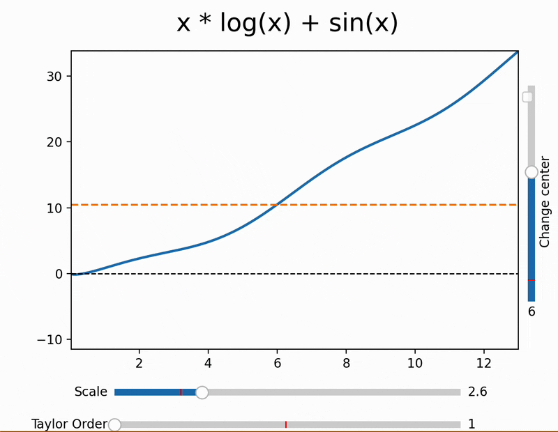

## Overview
This project is an interactive visualization of **Taylor's Formula** that demonstrates how a function can be locally approximated by a polynomial.

The simulation allows users to explore how:
- Increasing the order of the Taylor polynomial improves local accuracy
- Changing the expansion center affects approximation quality at various intervals
- The Taylor's Formula behaves at various domains by scaling the x-axis

The goal is to provide an intuitive, visual understanding of the Taylor Formula and its limitations.

---

## Features
- Interactive sliders for:
  - Taylor polynomial order
  - Expansion center (a)
  - X-axis scaling
- Real-time visualization of:
  - Original function
  - Taylor polynomial approximation
- Supports user-defined mathematical expressions
- Symbolic differentiation using SymPy
- Vectorized numerical evaluation using NumPy

---

## Demo


---

## Technologies
- Python
- NumPy
- Matplotlib (with `ipympl` backend for interactivity)
- SymPy

---

## Requirements

This project uses the `ipympl` backend for interactive Matplotlib widgets.
Make sure Jupyter Notebook or JupyterLab is installed.

---

## Installation

Clone the repository:
```bash
git clone https://github.com/Trumbubble/Taylors_Formula_Simulation.git
cd Taylors_Formula_Simulation

pip install -r requirements.txt

```
Then launch Jupyter Lab and run all the widgets.

```This project prioritizes interactivity which wouldn't be possible with standalone python```

---

## Function Input (equation.txt)

The file `equation.txt` contains the mathematical function to be visualized.
The function must be written on a **single line** using standard mathematical notation.

### Rules
- The variable must be `x`
- Use standard functions: `sin`, `cos`, `tan`, `exp`, `log`, `sqrt`
- Use `^` for exponentiation
- Do **not** prefix functions with `np.` or `sp.`
- Do **not** include spaces at the beginning or end of the line

### Examples
Valid inputs:
```text
sin(x) + x
x^2 - 3*x + 1
exp(-x^2)
sqrt(x) + log(x)
```

---

## License
This project is licensed under the MIT License.